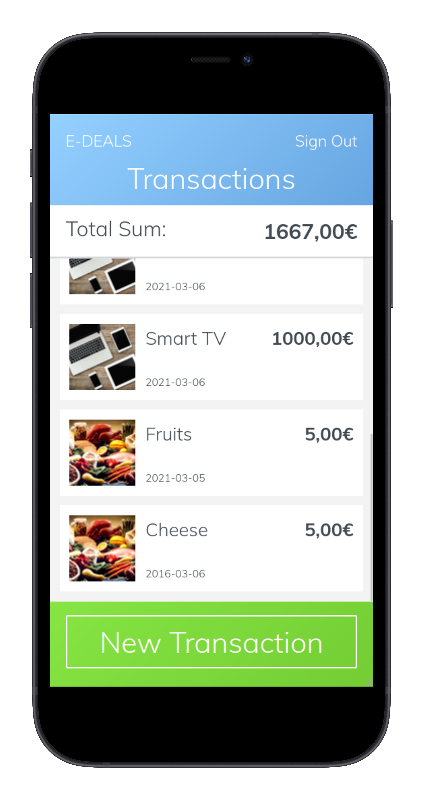

# E-DEALS - Keep your spendings in check!

Keep your spendings in check with E-DEALS! Create reminders for transactions you've made! Create groups like 'Food' or 'Sports' to categorize your spendings and share them with family&friends!! asdfasgasdg Add already existing Transactions to Groups! Simply sign-up with your username and (you know what it is) KEEP YOUR SPENDINGS IN CHECK! 

## Built With

- Ruby v2.7.0
- Ruby on Rails v5.2.4
- HTML5
- CSS3
- Bootstrap
- Rspec

## Presentation

https://www.loom.com/share/a451dd1b90894964b2c5af36d7428a4a

## Live Demo

To be updated!

## Getting Started

**To get this project set up on your local machine follow these simple steps:**

**Step 1** 
Navigate through the local folder where you want to clone the repository and run
`git clone https://github.com/marcode95/edeals`. 
**Step 2** 
Run `cd edeals`. 
**Step 3** 
Run `bundle install` to install the gems from the `Gemfile`. 
**Step 4** 
Run `yarn install` to install the packages from the `package.json` file. 
**Step 5** 
Run `rake db:create` to create you local database. 
**Step 6** 
Run `rake db:migrate` to create you local database. 
**Step 7** 
Run `rails server` to start the rails server. 
**Step 8** 
You can navigate to `http://localhost:3000/` to see your application running 

## Authors

👤 **Marco Erhardt**

- Github: [@marcode95](https://github.com/marcode95)

## Show your support

Give a ⭐️ if you like this project!

### Acknowledgements 🌟

Design by [Gregoire Vella](https://www.behance.net/gregoirevella)    
You can look at the design [here](https://www.behance.net/gallery/19759151/Snapscan-iOs-design-and-branding?tracking_source=)

## 📝 License

This project is [MIT](lic.url) licensed.
